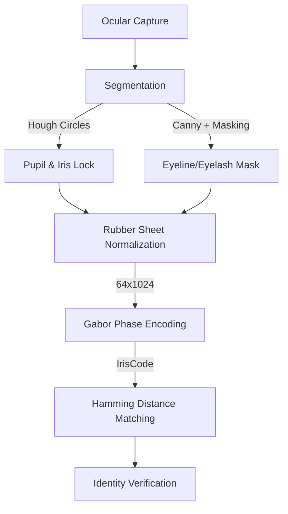

# 👁️ IrisGuard v3.0: High-Fidelity Iris Recognition

[](https://github.com/google-deepmind/antigravity)
[](https://opensource.org/licenses/MIT)
[](https://www.python.org/)

**IrisGuard** là một hệ thống nhận diện mống mắt (Iris Recognition) hiện đại, triển khai thuật toán kinh điển của **John Daugman**. Hệ thống được tối ưu hóa cho bộ dữ liệu **CASIA-Iris-Thousand**, cung cấp khả năng tách vùng (Segmentation), chuẩn hóa (Normalization) và mã hóa (Encoding) với độ chính xác cao.

---

## 🏗️ Kiến trúc Hệ thống (Architecture)



## ✨ Tính năng nổi bật

- **Precision Segmentation**: Sử dụng Hough Gradient Transform kết hợp với Adaptive Thresholding để khóa đồng tử và mống mắt ngay cả trong điều kiện ánh sáng yếu.
- **Rubber Sheet Model**: Chuyển đổi vùng mống mắt sang hệ tọa độ cực (Polar coordinates) để xử lý sự co giãn của đồng tử.
- **High-Entropy Encoding**: Sử dụng 2D Gabor Filters để tạo ra IrisCode 1024-bit, đảm bảo xác suất trùng lặp cực thấp (FAR cực nhỏ).
- **Premium Web Interface**: Giao diện SSR (Server-Side Rendering) hiện đại, hỗ trợ trực quan hóa kết quả so khớp (Hamming Heatmap) và quản lý đối tượng.
- **Offline-First**: Ưu tiên xử lý dữ liệu cục bộ, không phụ thuộc vào kết nối internet.

---

## 🚀 Hướng dẫn cài đặt (Setup)

Hệ thống sử dụng `uv` để quản lý dependencies một cách nhanh nhất.

1. **Cài đặt dependencies**:
   ```bash
   uv sync
   ```

2. **Chuẩn bị dữ liệu**:
   Đặt bộ dữ liệu vào thư mục `data/subset` theo cấu trúc: `data/subset/<subject_id>/S5<id><side><seq>.jpg`.

3. **Chạy ứng dụng Web**:
   ```bash
   uv run python -m src.api.main
   ```
   Truy cập: `http://localhost:8000`

4. **Chạy Benchmark**:
   ```bash
   uv run scripts/benchmark_accuracy.py
   ```

---

## 🤝 Credits & Collaboration

Dự án này được phát triển bởi **USER** tại **Đại học (University)** trong khuôn khổ môn học **An toàn thông tin (Information Security)**.

Toàn bộ hệ thống được thiết kế, lập trình và tối ưu hóa với sự hỗ trợ của **Antigravity**, một AI Coding Assistant mạnh mẽ từ đội ngũ **Advanced Agentic Coding** tại **Google DeepMind**. 

---

## 📄 License

Dự án này được phát hành dưới giấy phép **MIT License**. Xem file [LICENSE](LICENSE) để biết thêm chi tiết.
